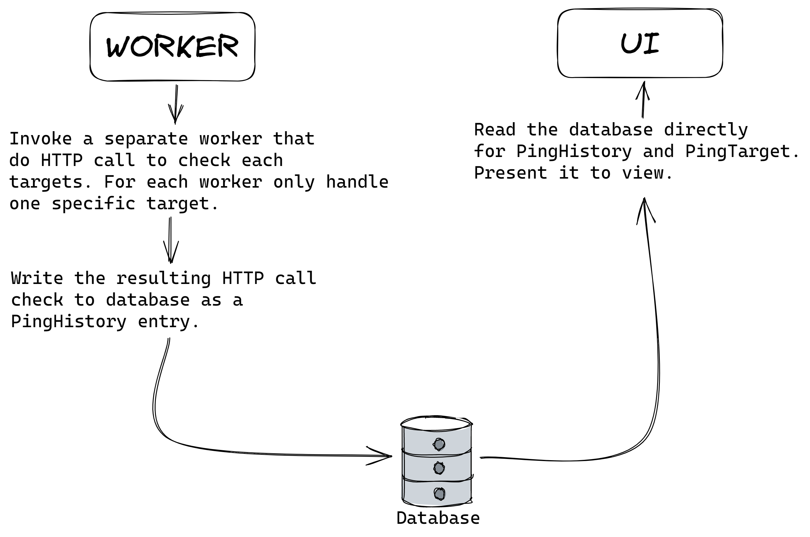

# Ohana


First and foremost, if you don't know the reference of the GIF above, you
should really watch the [Lilo & Stitch movie](https://en.wikipedia.org/wiki/Lilo_%26_Stitch).
It's a wholesome movie about finding who you are and your purpose in life.
Okay, enough talking.

This repository aims to be another alternative to [Uptime Kuma](https://github.com/louislam/uptime-kuma)
(in which Uptime Kuma itself is an alternative to [Uptime Robot](https://uptimerobot.com/)),
that let you configure the paths and endpoints to check using a simple configuration file.
There is no UI for the administrator, just a simple plain UI for the viewer.

If you would like to use a ready version for your own self-hosted uptime monitoring
tool, just use Uptime Kuma, or use [Semyi](https://github.com/teknologi-umum/semyi),
our own uptime monitoring tool that actually was made in a rush because we really need it.
Semyi finished earlier because at that time, [@aldy505](https://github.com/aldy505) 
understand Go enough for concurrent usage and [@elianiva](https://github.com/elianiva) 
understand frontend enough to handle [server sent event](https://developer.mozilla.org/en-US/docs/Web/API/Server-sent_events).
This project (Ohana) was meant to be the core uptime monitoring application made
by the organization, yet we don't have much time and knowledge to play around
and go with Kotlin... yet.

People are free to contribute in any way they can.

## Business Flow



1. There will be a worker process that processes (and handle) a specific ping target (defined as PingTarget). That means there will be multiple worker running concurrently just as much as the ping targets are.
2. For each interval defined by the PingTarget, the worker will invoke a HTTP request call and gather the result.
3. The worker will process the result, write it into the database as a ping history (later defined as PingHistory) entry.
4. The UI (running separately from the Worker, of course) will read the database for any changes if there are any request from the client side to view the data.

It's actually that simple. For any discussion 

## License

```
Copyright 2023 Teknologi Umum and Ohana contributors

Licensed under the Apache License, Version 2.0 (the "License");
you may not use this file except in compliance with the License.
You may obtain a copy of the License at

   http://www.apache.org/licenses/LICENSE-2.0

Unless required by applicable law or agreed to in writing, software
distributed under the License is distributed on an "AS IS" BASIS,
WITHOUT WARRANTIES OR CONDITIONS OF ANY KIND, either express or implied.
See the License for the specific language governing permissions and
limitations under the License.
```

See [LICENSE](./LICENSE)